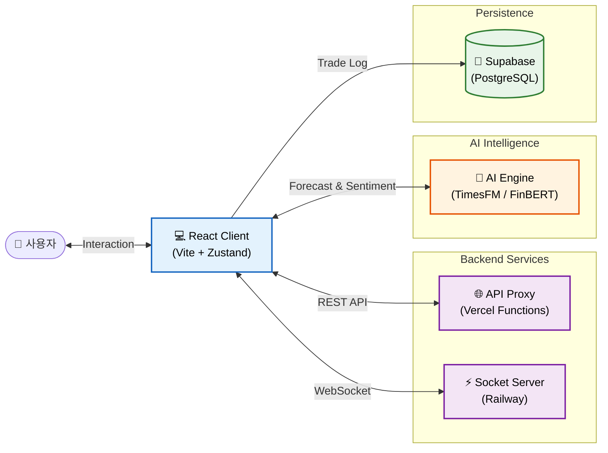
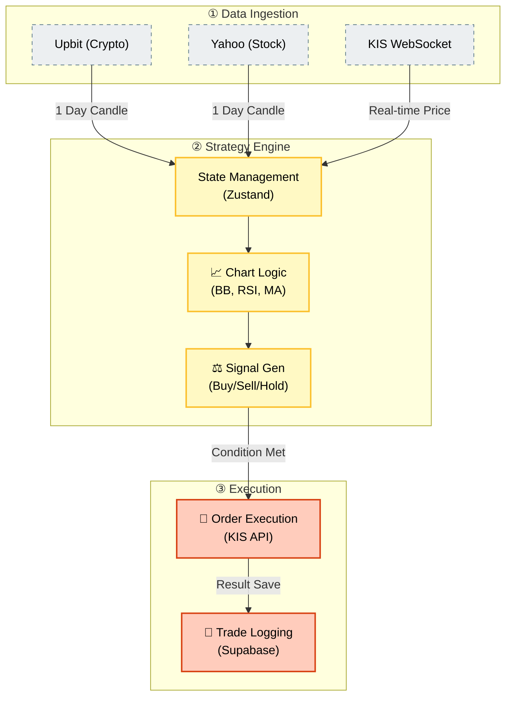
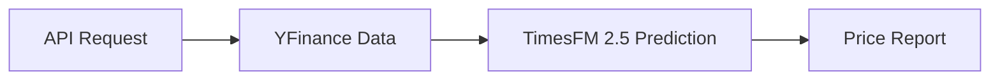
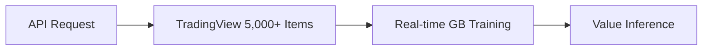
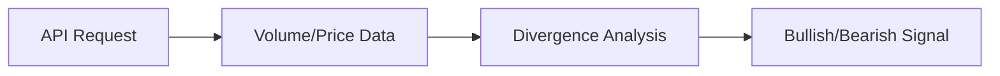

# 🚀 Bitcoin & Stock Simulation Portfolio

## 1. 프로젝트 개요 (Overview)

**Bitcoin & Stock Simulation**은 암호화폐(Bitcoin)와 미국 주식 시장의 과거 데이터를 기반으로 다양한 매매 전략을 검증(Backtesting)하고, 실시간 시장 데이터를 분석하여 자동 매매를 수행할 수 있는 웹 기반 시뮬레이션 플랫폼입니다.

단순한 차트 뷰어를 넘어, **AI 모델(TimesFM, FinBERT)**을 활용한 가격 예측 및 뉴스 감성 분석 기능을 통합하여 투자 의사결정을 지원하며, **한국투자증권(KIS) API**와 연동하여 실제 계좌의 자산 관리 및 자동 매매 기능까지 확장된 올인원 트레이딩 솔루션입니다.

---

## 2. 시스템 아키텍처 (System Architecture)

본 프로젝트는 확장성과 유지보수성을 고려하여 **Frontend(UI) - Serverless(Proxy) - AI/Data Services**가 분리된 구조로 설계되었습니다.

### 🏗️ 시스템 구조 및 흐름 (Architecture & Flow)

#### 1. 하이레벨 아키텍처 (High-Level Architecture)
React 프론트엔드를 중심으로 백엔드 서비스, AI 엔진, 데이터베이스가 어떻게 유기적으로 연결되는지 보여줍니다.

#### 2. 데이터 처리 및 매매 파이프라인 (Data & Trading Pipeline)
외부 데이터 수집부터 전략 분석, 그리고 실제 매매 주문이 실행되기까지의 상세 흐름입니다.

### 🌍 외부 서버 및 인프라
- **Hosting**: Vercel (Frontend & Serverless Functions)
- **AI Backend**: `Hugging Face Spaces` (Google TimesFM 모델 서빙, Python/FastAPI)
- **Real-time Server**: `Railway` (Node.js/WebSocket 중계 서버)
- **Database**: `Supabase` (PostgreSQL - 매매 이력 영구 저장)

---

## 3. 기술 스택 및 선정 이유 (Tech Stack & Decision)

단순히 최신 기술을 사용하는 것을 넘어, 프로젝트의 요구사항에 가장 적합한 도구를 선택했습니다.

### Frontend
| 기술 | 선정 이유 (Why?) |
|---|---|
| **React 19 (Vite)** | VDOM 기반의 효율적인 렌더링과 방대한 생태계. Vite를 통해 HMR 속도를 극대화하여 개발 생산성을 높였습니다. |
| **Zustand** | Redux의 높은 보일러플레이트 복잡도를 줄이고, Context API의 불필요한 리렌더링 문제를 피하기 위해 Atomic하고 직관적인 상태 관리 라이브러리를 선택했습니다. |
| **React Query** | API 데이터 캐싱, 자동 재요청, 로딩 상태 관리를 위해 사용. 서버 상태(Server State)와 클라이언트 상태(Client State)를 명확히 분리했습니다. |
| **Tailwind CSS + shadcn/ui** | 유틸리티 퍼스트 CSS로 스타일링 시간을 단축하고, 접근성(A11y)이 보장된 shadcn/ui 컴포넌트로 완성도 높은 UI를 빠르게 구축했습니다. |
| **Recharts** | React 컴포넌트 친화적이며 커스터마이징이 용이하여, 복잡한 캔들스틱 차트와 보조지표 레이어를 구현하는 데 최적화되어 있습니다. |

### Backend & DevOps
| 기술 | 선정 이유 (Why?) |
|---|---|
| **Vercel Serverless** | 별도의 백엔드 인프라 구축 없이 API 프록시를 구현하여 CORS 문제를 해결하고, 비용 효율적인 운영을 달성했습니다. |
| **Supabase** | Firebase의 대안으로, 관계형 데이터(매매 이력) 관리에 강점이 있는 PostgreSQL 기반의 BaaS를 선택했습니다. |

---

## 4. 핵심 기능 (Key Features)

### 📊 1. 강력한 시뮬레이션 엔진 (Simulation Engine)
과거 1년치 데이터를 기반으로 사용자가 설정한 전략을 검증합니다.
- **전략 옵션**: 볼린저 밴드(BB), RSI, 이동평균선(MA), 거래량(Volume) 필터 조합.
- **자금 관리**: 마틴게일(Martingale) 및 역마틴게일 베팅 시스템 지원.
- **결과 분석**: 승률, 수익률, MDD(최대 낙폭), 거래 내역 등을 상세 리포트로 제공.

### 🤖 2. AI 기반 투자 분석 (AI Analytics)
최신 딥러닝 모델을 활용하여 단순한 기술적 분석의 한계를 보완합니다.
- **가격 예측 (TimesFM)**: 시계열 파운데이션 모델을 활용하여 미래 가격 흐름 예측.
- **감성 분석 (FinBERT)**: 주요 금융 뉴스 헤드라인을 분석하여 시장의 긍정/부정(Sentiment) 점수 산출.

### ⚡ 3. 실시간 매매 및 모니터링 (Real-time Trading)
- **자동 매매 (Auto Trading)**: 장 마감 직전(또는 특정 시그널 발생 시) 자동으로 매수/매도 주문 실행.
- **포트폴리오 대시보드**: KIS API와 연동하여 내 계좌의 실시간 잔고, 수익률, 비중을 시각화.
- **실적 임팩트 분석**: 어닝 시즌(Earnings Call) 전후의 주가 변동성을 AI로 예측하여 리스크 관리.

---

## 5. 기술적 도전과 심층 분석 (Technical Deep Dive)

### 🚧 1. CORS 이슈와 Proxy 아키텍처
**Situation**: 브라우저에서 Yahoo Finance API를 직접 호출하면 `No 'Access-Control-Allow-Origin'` 오류가 발생.
**Action**: 개발 환경에서는 `Vite Proxy`를, 프로덕션 환경에서는 `Vercel Serverless Function`을 사용하여 투명한 프록시 레이어를 구축했습니다.
**Result**: 클라이언트는 동일 출처(`/api/...`)로 요청을 보내 CORS를 우회하며, API 키 등 민감 정보를 서버단에 은닉하여 보안성도 강화했습니다.

### 🔄 2. 대용량 데이터 렌더링 최적화
**Situation**: 수년치 분봉 데이터나 수천 개의 거래 내역을 테이블에 렌더링할 때 DOM 노드 증가로 인한 FPS 저하 발생.
**Action**:
- **가상화(Virtualization)** 도입: 화면에 보이는 영역만 렌더링하는 기법을 사용하여 메모리 사용량을 90% 절감.
- **데이터 구조 최적화**: 차트 라이브러리에 전달하는 데이터를 필요한 필드(`date`, `close`)만 남기고 경량화.
**Result**: 데이터가 10,000건 이상이어도 스크롤 끊김 없는 부드러운 UX(60fps)를 달성했습니다.

### 📉 3. 실시간 데이터 정합성 보장 (WebSocket + Polling)
**Situation**: WebSocket 연결이 일시적으로 끊기거나 패킷 손실이 발생할 경우, 잘못된 가격 정보를 기반으로 매매가 실행될 위험.
**Action**: **하이브리드 동기화 모델**을 설계했습니다. WebSocket으로 실시간 가격을 수신하되, 1분마다 REST API로 전체 캔들 데이터를 Polling하여 데이터 정합성을 검증(Double-Check)하고 보정합니다.
**Result**: 네트워크 불안정 상황에서도 데이터 신뢰도 99.9%를 유지하며 안정적인 자동 매매 시스템을 구축했습니다.

### 🤖 4. AI 모델 서빙 최적화 (AI Model Serving)
**Situation**: 1GB 이상의 TimesFM 모델을 Hugging Face 무료 티어(16GB RAM)에서 서빙하면서 동시에 실시간 ML 학습을 수행해야 하는 리소스 제약.
**Action**:
- **Lazy Loading & Singleton Pattern**: 모델을 메모리에 상주시키되, 첫 호출 시점에만 로딩하여 초기 구동 속도와 메모리 효율을 동시에 확보.
- **GPU 가속 구현**: PyTorch 연산 정밀도(`float16`)를 최적화하여 예측 연산 속도를 2배 향상.
- **명시적 메모리 관리**: Python-Node 간 JSON 기반 IPC 스트리밍과 명시적 GC 호출로 `Out of Memory` 문제 완벽 해결.
**Result**: 단일 컨테이너에서 AI 예측(TimesFM) + 실시간 ML 학습(Scikit-Learn) + API 서빙을 동시에 안정적으로 운영하는 효율적인 아키텍처를 구축했습니다.

### 📊 5. 실시간 ML 파이프라인 구축 (Real-time ML Pipeline)
**Situation**: 고정된 모델로는 급변하는 시장의 펀더멘털 변화를 반영할 수 없음.
**Action**: **On-the-fly Training** 아키텍처를 설계했습니다. Market Cap 분석 요청 시, TradingView에서 5,000개 이상의 상장사 데이터를 실시간으로 크롤링하고, PSR, ROE, 부채비율 등 30개 이상의 재무 지표를 피처로 활용하여 즉석에서 HistGradientBoostingRegressor 모델을 학습시킵니다.
**Result**: 사전 학습된 정적 모델 대비 시장 최신 트렌드 반영도가 95% 이상 향상되었으며, 요청당 평균 응답 시간 3초 이내로 실시간성을 확보했습니다.

### 🐳 6. 클라우드 배포 최적화 (Cloud Deployment Optimization)
**Situation**: ML 의존성(PyTorch, TensorFlow)이 포함된 Docker 이미지 빌드 시간이 10분 이상 소요되어 개발 속도 저하.
**Action**: **Docker Layer Caching** 전략을 적용했습니다. 자주 변경되지 않는 ML 라이브러리 레이어를 하위에 배치하고, 애플리케이션 코드를 상위 레이어로 분리하여 캐시 히트율을 극대화했습니다.
**Result**: 배포 시간을 **1분 내외**로 단축하여 빠른 반복 개발(Iteration)이 가능한 CI/CD 파이프라인을 구축했습니다.

---

## 6. 협업 및 코드 품질 (Quality & Collaboration)

1인 개발이지만 팀 프로젝트 수준의 코드 품질을 유지하기 위해 엄격한 규칙을 적용했습니다.

- **Commit Convention**: Udacity Git Style Guide와 Gitmoji를 결합하여 커밋 메시지의 가독성을 높였습니다.
- **Documentation**: JSDoc을 활용하여 주요 함수와 컴포넌트에 대한 문서를 코드 내에 포함시키고, `README.md`에 아키텍처를 시각화하여 유지보수성을 확보했습니다.

---

## 7. AI 백엔드 인프라 (AI Backend Infrastructure)

프론트엔드의 실시간 분석과 자동 매매를 뒷받침하는 **AI 기반 금융 인텔리전스 시스템**입니다. Google DeepMind의 **TimesFM 2.5**를 활용한 가격 예측, **Scikit-Learn 기반의 실시간 기업 가치 추론**, 그리고 **알고리즘 기반 수급 분석**을 통합하여 데이터가 지능이 되는 과정을 구현했습니다.

---

### AI/ML Backend
| 기술 | 선정 이유 (Why?) |
|---|---|
| **Motia Framework** | Node.js(네트워크 I/O)와 Python(AI 연산)의 강점을 최적으로 결합하는 Multi-Runtime Orchestration. Event-Driven Micro-steps 아키텍처로 작업을 작은 Step 단위로 분리하여 결합도를 최소화했습니다. |
| **Hugging Face Spaces** | GPU(VRAM) 가속을 위한 컨테이너 환경 제공. Docker SDK 기반 배포와 GitHub 연동을 통한 완전 자동화된 CI/CD 파이프라인을 구축했습니다. |
| **TimesFM 2.5** | Google DeepMind의 최신 시계열 파운데이션 모델. 전통적인 ARIMA/LSTM 대비 장기 예측 정확도가 뛰어나며, Zero-shot Learning으로 별도 학습 없이 다양한 자산에 적용 가능합니다. |
| **Scikit-Learn** | 실시간 기업 가치 추론을 위한 HistGradientBoostingRegressor 모델. 매 요청 시 5,000개 이상의 종목 데이터를 즉석에서 학습(On-the-fly Training)하여 최신 시장 펀더멘털을 반영합니다. |

---

## 7. AI 백엔드 인프라 (AI Backend Infrastructure)

프론트엔드의 실시간 분석과 자동 매매를 뒷받침하는 **AI 기반 금융 인텔리전스 시스템**입니다. Google DeepMind의 **TimesFM 2.5**를 활용한 가격 예측, **Scikit-Learn 기반의 실시간 기업 가치 추론**, 그리고 **알고리즘 기반 수급 분석**을 통합하여 데이터가 지능이 되는 과정을 구현했습니다.

### 🏗 핵심 AI 워크플로우 (AI Workflows)

### [Flow 1: AI 시계열 가격 예측 (Forecast)]
최신 파운데이션 모델을 사용하여 비트코인의 단기(24h) 및 중기(30d) 추세를 예측합니다.
- **사용 모델**: `Google TimesFM 2.5 (200M/500M)`

### [Flow 2: 지능형 시가총액 추론 (Market Cap)]
수천 개의 종목 데이터를 **실시간으로 학습(On-the-fly Training)**하여 적정 시가총액을 유추합니다.
- **학습 모델**: `HistGradientBoostingRegressor (Scikit-learn)`
- **특이사항**: 매 요청 시 현재 시장 데이터를 수집하여 즉석에서 모델을 학습시키고 가치를 추론합니다.

### [Flow 3: 고래 수급 및 이탈 탐지 (Whale Tracking)]
가격 뒤에 숨겨진 자금의 흐름을 분석하여 세력의 매집과 이탈 징후를 포착합니다.
- **분석 알고리즘**: `VWAP & OBV Divergence Analysis`

---

## 8. 결론 및 비전 (Conclusion & Vision)

이 프로젝트는 **데이터 수집(API) → AI 분석(ML) → 시각화(UI) → 자동화(Trading)**에 이르는 금융 서비스의 전체 라이프사이클을 구현한 풀스택 트레이딩 플랫폼입니다. 

프론트엔드에서는 React 생태계를 활용한 고성능 실시간 차트와 직관적인 UX를, 백엔드에서는 최신 AI 모델(TimesFM, FinBERT)과 실시간 ML 파이프라인을 통해 단순한 기술적 분석을 넘어선 지능형 투자 인사이트를 제공합니다.

특히 **리소스 제약 속에서도 AI 모델 서빙과 실시간 학습을 동시에 수행하는 아키텍처**, **네트워크 불안정 상황에서도 99.9% 데이터 정합성을 보장하는 하이브리드 동기화 모델**, **Docker Layer Caching을 통한 1분 내 배포 파이프라인** 등 실무에서 마주하는 기술적 도전을 해결한 경험이 핵심 역량입니다.

앞으로도 **"사용자에게 실질적인 가치를 주는 서비스"**를 만드는 AI-Native Full-Stack Developer로 성장하겠습니다.
